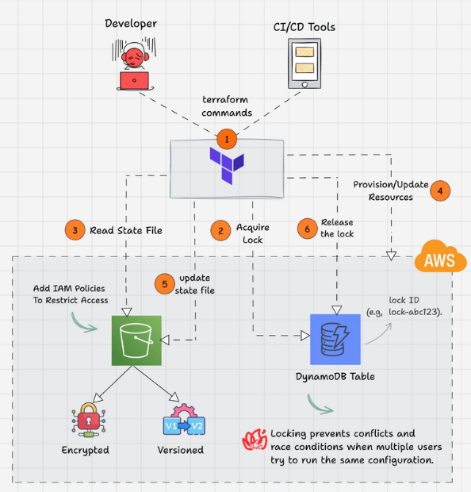

Vorbereitung:
- In der Konsole, zunächst wie es sich für sensible Systeme gehört, MFA konfigurieren
- AWS-Zugang vorbereiten, z. B. über `awsume`, `aws-vault` oder ein gültiges `AWS_PROFILE`

Artikel:
https://devopscube.com/setup-terraform-remote-state-s3-dynamodb/

### Konfiguration dieser...
- Empfohlen für die Arbeit mit der AWS CLI ist ein SSO token provider https://docs.aws.amazon.com/cli/latest/userguide/cli-configure-sso.html

- OpenTofu verwendet die aktuell aktive AWS-Authentifizierung. In diesem Repository ist absichtlich **kein festes Profil** mehr im Code hinterlegt.
- Vor `tofu init`, `tofu plan` oder `tofu apply` daher **immer zuerst** einen AWS-Kontext aktivieren.

***Beispiel mit `awsume`:***

```
awsume tefde-sandbox
```

***Alternativ mit `AWS_PROFILE`:***

```
export AWS_PROFILE=tefde-sandbox
```

***Kurztest vor OpenTofu:***

```
aws sts get-caller-identity --region eu-central-1
```

]


Um einen state (Vergelich mit Konflikten in git) für alle effektiv einzusetzten, wird im ASS eine DynamoDB Tabelle (Wer blockt den state?) 
und ein S3 bucket mit dem state selbst angelegt. Dieser kann im Landingzone sehr lang sein.

Wichtig: Dieses Repository startet **absichtlich ohne aktiviertes S3-Backend**. So kann die Infrastruktur im ersten Schritt lokal gebootstrapped werden, ohne dass ein alter oder fremder Bucket-Name den Ablauf blockiert.


Der Terraform workflow ist der folgene:
- ***main.tf*** oder andere Dateien anlegen
- Mit ***tofu init*** wird das Verzeichnis initialisiert ---> vergleichbar mit `git init`
- `tofu plan` zeigt die geplanten Änderungen an
- Sind die unter `plan` gelisteten Änderungen wie erwartet, setzt man sie mit `tofu apply` um
- Optional kann der lokale State danach in ein S3-Backend migriert werden
- Mit ***tofu destroy*** löscht man die Instanz


Vorbereitung:
- In der Konsole, zunächst wie es sich für sensible Systeme gehört, MFA konfigurieren
- AWS-Kontext aktivieren (`awsume tefde-sandbox` oder `export AWS_PROFILE=tefde-sandbox`)
- Die Terraform-Konfiguration verwendet automatisch die **Default VPC** des Accounts in `eu-central-1`.
- Das öffentliche und das private Subnetz werden dabei von OpenTofu selbst angelegt; eine bestehende Subnet-ID muss nicht mehr manuell nachgeschlagen werden.


## Schritte auf der Konsole:

Variante A mit `awsume`:

```bash
awsume tefde-sandbox
```

Variante B mit `AWS_PROFILE`:

```bash
export AWS_PROFILE=tefde-sandbox
```


```bash
cd infrastructure/terraform
tofu init
```

Der erste `tofu init` läuft jetzt **lokal**, damit S3-Bucket und DynamoDB-Tabelle zunächst von OpenTofu selbst angelegt werden können.

```bash
tofu plan
tofu apply
```

# Namen für den späteren Remote State anzeigen
```bash
tofu output terraform_state_bucket_name
tofu output terraform_state_lock_table_name
```

# Optional: Migration auf S3 nach dem ersten apply
```bash
cp backend.tf.example backend.tf
cp backend.hcl.example backend.hcl
```

Dann in `backend.hcl` den echten Bucket-Namen aus `tofu output terraform_state_bucket_name` eintragen und anschließend migrieren:

```bash
rm -rf .terraform
tofu init -backend-config=backend.hcl -migrate-state
```

Troubleshooging:
Eventuell wiederspenstige Resourcen in der Webkonsole oder mit der CLI löschen. 


```bash
rm -rf .terraform
rm -f terraform.tfstate terraform.tfstate.backup
tofu init
tofu apply
```
