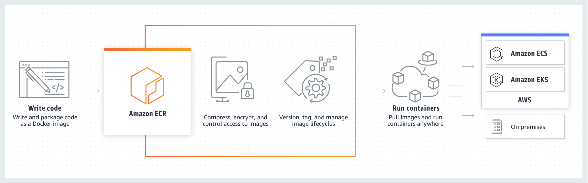

# ECR (Elastic Container Registry) 

**Was ist ECR?**
ECR ist ein Container-Registry-Service von AWS - eine Art "Docker Hub" von Amazon. Hier speicherst du deine Docker-Images, damit deine Anwendungen sie später nutzen können.

**Wichtige Konzepte:**

## 1. Zentrale Image-Speicherung
- ECR ist wie eine zentrale Bibliothek für deine Docker-Images
- Du pushst deine Images einmal zu ECR
- Alle deine Services können diese Images dann von dort abrufen

## 2. **Netzwerk-Unabhängigkeit** (wichtig!)
- ECR ist ein **AWS-weiter Service** - kein VPC-spezifischer Service
- Deine ECS-Tasks, EC2-Instances oder Lambda-Funktionen müssen **nicht im gleichen Netzwerksegment** (VPC/Subnet) sein wie ECR
- ECR existiert "außerhalb" deines VPCs in der AWS-Infrastruktur



## 3. Zugriff auf ECR

**Variante A: Über Internet**
```
[Dein VPC/Subnet] → Internet Gateway → ECR Service
```
- Instances brauchen öffentliche IP oder NAT Gateway
- Traffic geht über das Internet

**Variante B: Über VPC Endpoint (privat)**
```
[Dein VPC/Subnet] → VPC Endpoint → ECR Service
```
- Traffic bleibt im AWS-Netzwerk
- Sicherer und oft günstiger
- Auch für komplett private Subnets möglich

## 4. Authentifizierung
- Zugriff erfolgt über **IAM-Rollen** und Policies
- Keine Netzwerk-Nachbarschaft nötig
- Services aus verschiedenen VPCs oder Accounts können auf dasselbe ECR zugreifen (mit entsprechenden Berechtigungen)

**Praxis-Beispiel:**
Du hast ein ECS-Cluster in `VPC-A/Subnet-Private` und eine EC2-Instance in `VPC-B/Subnet-Public`. Beide können das gleiche ECR-Image nutzen, solange sie:
1. Internet-Zugriff ODER VPC-Endpoints haben
2. Die richtigen IAM-Berechtigungen besitzen
