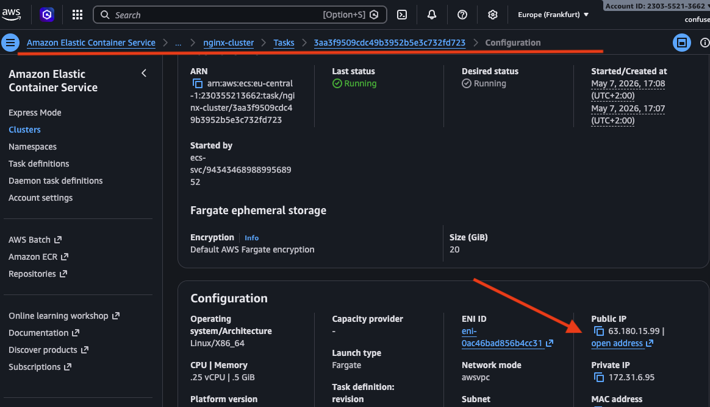

## Was du tun musst, um dich einzuloggen:
### 1. AWS-Kontext aktivieren

```bash
awsume tefde-sandbox
```

### 2. OpenTofu apply

``` bash
cd infrastructure/terraform
tofu apply
```

Dabei erzeugt OpenTofu automatisch:
- ein AWS Key Pair namens `ec2-sandbox-key`
- die lokale PEM-Datei `infrastructure/terraform/ec2-sandbox-key.pem`

## 3. SSH-Verbindung aufbauen
``` bash
# Public IP aus Terraform Output
tofu output ec2_public_ip

# Pfad zur PEM-Datei aus Terraform Output
tofu output -raw ec2_private_key_path

# SSH Login
ssh -i ./ec2-sandbox-key.pem ec2-user@<PUBLIC_IP>
```

## Kleine Ügung Mit wget auf den nginx Container zugreifen

***Wir greifen mit wget auf die index.html Datei auf dem nginx Container zu***

#### Tasks auflisten

```
aws ecs list-tasks \
--cluster nginx-cluster \
--region eu-central-1
```
#### Private IP des nginx Containers holen

```
aws ecs describe-tasks \
--cluster nginx-cluster \
--tasks <TASK_ARN> \
--region eu-central-1 \
--query 'tasks[0].attachments[0].details[?name==`privateIPv4Address`].value' \
--output text
```

### Alternativ mit der AWS Web Console



#### Mit wget daruf zugreifen

```ubuntu@ip-172-31-5-152:~/.ssh$ wget http://172.31.6.95
--2026-05-13 13:20:08--  http://172.31.6.95/
Connecting to 172.31.6.95:80... connected.
HTTP request sent, awaiting response... 200 OK
Length: 853 [text/html]
Saving to: ‘index.html’

index.html                                                                  100%[=========================================================================================================================================================================================>]     853  --.-KB/s    in 0s

2026-05-13 13:20:08 (103 MB/s) - ‘index.html’ saved [853/853]```


